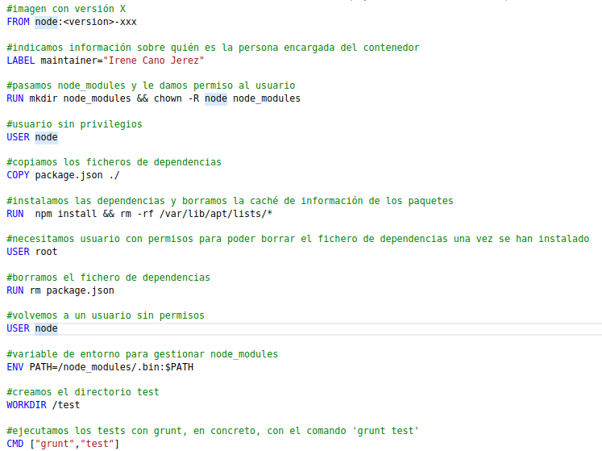
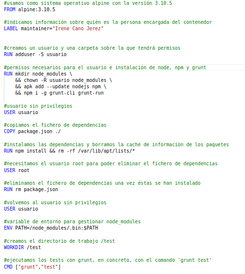

# DOCKERFILES QUE HAN SIDO USADOS PARA LAS PRUEBAS

## NODE VERSIÓN 14 Y 15
Para hacer las pruebas con las diferentes imágenes tanto de node en la versión 15 como en la 14 nos hemos basado en el siguiente fichero:

El único cambio que hemos tenido que realizar es cambiar la primera línea de nuestro Dockerfile, donde tendremos que indicar que imagen de node estamos usando, por ejemplo, *node14*, *node15-alpine3.10*, entre otras.

Vemos que hacemos uso del usuario *node* que viene ya con la imagen y creamos la carpeta *node_modules* sobre la cual este usuario tendrá permisos.

Establecemos node como nuestro usuario sin privilegios y copiamos los ficheros de dependencias. A continuación, debemos instalar las dependencias y una vez instaladas debemos volver al usuario *root* para poder borrar dicho fichero.

Volvemos a nuestro usuario sin privilegios y el siguiente paso es crear una variable de entorno con la ruta para node_modules y cambiamos el directorio de trabajo a *test*.

Finalmente ejecutamos los tests con *grunt test*.

## ALPINE COMO SISTEMA OPERATIVO

En este caso lo único que cambia respecto al anterior es que la imagen no trae un usuario, por tanto debemos crearlo nosotros y además, tenemos que instalar *npm* y *node*. Para ello, creamos un usuario, creamos también un directorio para *node_modules* y le damos al usuario permisos sobre este. A continuación, debemos instalar *npm*, *node* y *grunt*.

El resto del dockerfile es similar al anterior.

## UBUNTU COMO SISTEMA OPERATIVO

Aquí ocurre igual que con *Alpine*, debemos añadir un usuario y tenemos que instalar *npm*, *node* y *grunt*.

Una vez hecho esto, el resto del dockerfile se queda igual que en los anteriores.
