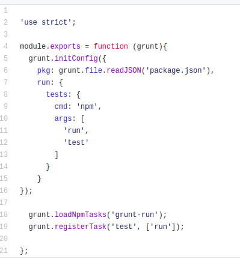

# EXPLICACIÓN DE GRUNT Y GRUNTFILE  
Grunt es un task runner basado en Node.js y hemos decidido usarlo para nuestro proyecto básicamente porque la creación de tareas me resultaba más cómoda y un poco más comprensible que al usar Gulp, pero ambos me parecen muy adecuados para el proyecto y muy eficientes, por lo que podría elegirse cualquiera de ellos.

## GRUNTFILE
En la siguiente imagen podemos ver nuestro [Gruntfile](https://github.com/irenecj/proyecto-idiomas/blob/master/Gruntfile.js):

Para comenzar, toda la configuración de Grunt se define usando el método **initConfig**, que recibe un objeto con las distintas opciones de configuración y que además, nos permite definir las tareas que queremos ejecutar.

Nada más empezar le indicamos cual es nuestro fichero de dependencias.

A continuación debemos incorporar nuestra tarea para ejecutar los tests. En nuestro caso, en este punto, me encontré con cierta dificultad a la hora de definir dicha tarea, ya que me han surgido diversos problemas relacionados con las versiones. En cuanto al último error que obtuve, no he encontrado en Internet cómo arreglarlo pero si encontré un [repositorio en GitHub](https://github.com/leebyron/grunt-jest) donde se comenta que el uso de **grunt-jest** ya está obsoleto y propone una alternativa: ésta se basa en que en vez de hacer una tarea para realizar los tests, podemos usar el plugin **grunt-run** junto con un script de npm que llame a *Jest*. Por tanto, he definido una tarea la cual ejecuta los tests cuando usamos el comando **grunt test** y que se basa en hacer uso del plugin **grunt-run** como hemos comentado.

Con **loadNpmTasks** podemos cargar "plugins" para grunt que aumentan su funcionalidad.

Finalmente, usamos **registerTask** para definir nuestra tarea que lanzará la ejecución de los tests.
