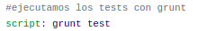

# USO DEL GESTOR DE TAREAS AL AÑADIR INTEGRACIÓN CONTINUA
En este documento vamos a ver como se ha hecho uso del gestor de tareas tanto al trabajar con Travis CI como con Circle CI.

## TRAVIS CI
En el caso de Travis, el primer fichero de configuración que diseñamos estaba enfocado a añadir integración continua al proyecto sin hacer uso del contenedor de Docker Hub. Debido a esto, una vez instalábamos Jest y Grunt junto con el resto de dependencias debíamos usar el gestor de tareas, en nuestro caso **Grunt** para poder ejecutar los tests.

## CIRCLE CI
En este caso, tuvimos que hacer uso del gestor de tareas tanto al no aprovechar el contenedor como cuando lo utilizamos. Esto se debe a que, en el primer caso, al igual que ocurre con Travis, una vez instalados Jest y Grunt y el resto de dependencias, debemos ejecutar los tests haciendo uso del gestor de tareas.
Por otro lado, ya explicamos en otro [documento](https://github.com/irenecj/proyecto-idiomas/blob/master/docs/integracion-continua/circle/Circe-CI.md) que cuando diseñamos el fichero de configuración haciendo uso del contenedor, lo primero que hacemos en nuestra tarea es indicar la imagen que vamos a utilizar, ¿cómo hacemos esto?, poniendo lo siguiente:
~~~
docker:
  - image: irenecj/proyecto-idiomas
~~~

¿Qué hace exactamente esta línea?, pues simplemente nos introduce dentro de nuestro contenedor, por lo que para poder lanzar los tests, tendremos que usar nuestro gestor de tareas.
