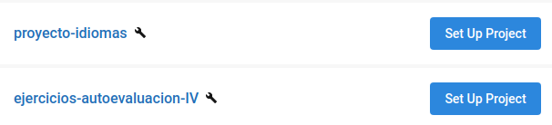
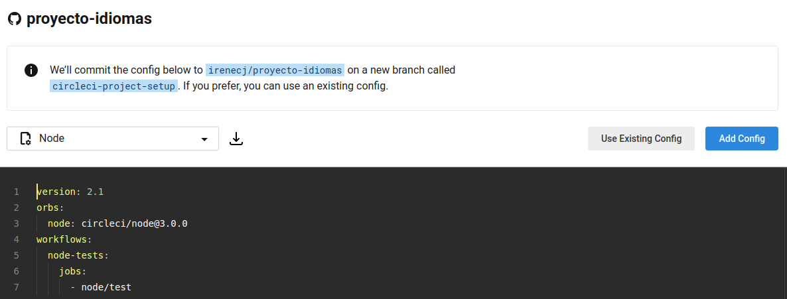
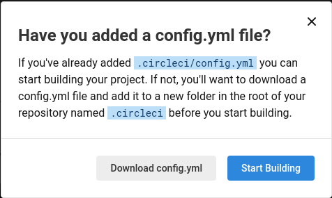
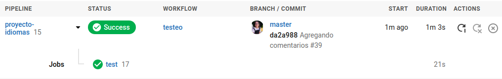

# PROCESO DE REGISTRO EN LOS SISTEMAS DE INTEGRACIÓN CONTINUA UTILIZADOS

## TRAVIS-CI
1. **Darnos de alta:** simplemente debemos autorizar a Travis para acceder a nuestro contenido en GitHub.
Cuando accedemos a su página web nos permite [darnos de alta](https://travis-ci.com/signin). Debemos darle a *Sign in with GitHub* y nos pedirá la autorización que hemos comentado al principio.
2. **Activar el repositorio en el que se aplicará la integración continua:** la propia página web nos indica como realizar los siguientes pasos. En este primero, debemos darle a *Activate all repositories using GitHub Apps*, y seleccionamos si queremos aplicar integración continua en todos los repositorios o sólo en aquellos que indiquemos.

3. **Agregar fichero de configuración:** este fichero se llamará [*.travis.yml*](https://github.com/irenecj/proyecto-idiomas/blob/master/.travis.yml) y se colocará en el directorio raíz de nuestro repositorio. En este [fichero](https://github.com/irenecj/proyecto-idiomas/blob/master/docs/travis/pruebas-travis.md) podemos ver cómo se ha construido dicho fichero de configuración y sus diferentes secciones.

4. **Añadimos el fichero de configuración al repositorio: ** una vez hagamos *push* Travis comenzará a testear y nos proporcionará los resultados obtenidos.

## CIRCLE-CI
1. **Darnos de alta:** debemos comenzar accediendo a la página web de [Circle-CI](https://circleci.com/signup/?new_design=1) e indicar que nos queremos registrar con la cuenta de GitHub.

2. **Set up project:** ahora nos aparecerá un listado con los repositorios vinculados a nuestra cuenta de GitHub, junto con un botón que nos dice *Set Up Project*.

 Si hacemos click en él nos aparecerá lo siguiente:

Vemos, en la parte de arriba de la imagen, que nos comentan que se creará una rama nueva llamada *circleci-project-setup*, pero que si lo preferimos podemos usar una configuración existente. En nuestro caso, nos hemos decantado por la segunda opción, es decir, hemos creado en la raíz de nuestro repositorio un directorio llamado *.circleci* y dentro de él hemos creado el [fichero de configuración](https://github.com/irenecj/proyecto-idiomas/blob/master/.circleci/config.yml), llamado *config.yml*.

A continuación, debemos seleccionar *Use Existing Config* y le damos a *Start Building* que nos redirigirá al apartado de *Dashboard* donde comenzará a ejecutarse el test.

Una vez realizado el test, nos aparecerá si éste ha tenido éxito, o si por el contrario ha fallado, en cuyo caso nos indica en qué parte ha surgido el fallo y cuál es el error devuelto. También nos aporta información como cuánto ha tardado en ejecutar el test y, la rama y el commit asociados a dicho test.

Si ahora volvemos al apartado de *Projects* vemos que al lado de nuestro repositorio ya no nos aparece *Set Up Project* sino que pone *Unfollow Project*, ¿qué quiere decir esto?, es muy simple. Esto nos indica que ahora mismo, cada vez que hagamos *push* a nuestro repositorio de GitHub, se realizará el test de dicho repositorio. En el caso de que le demos a *Unfollow Project*, tendremos que repetir los pasos anteriores.
