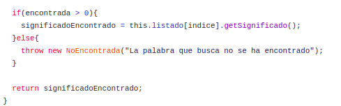
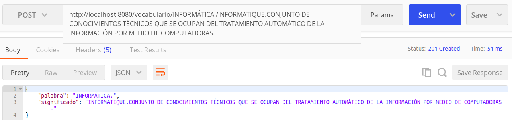
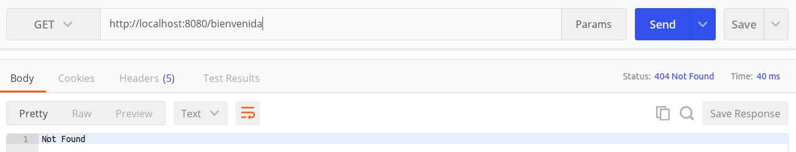
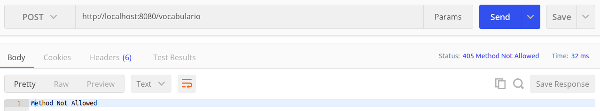
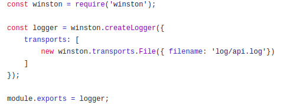
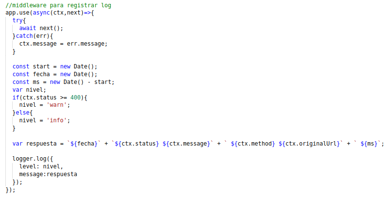
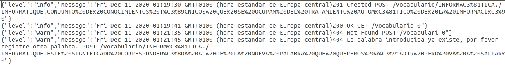

# USO DE BUENAS PRÁCTICAS: USO DE MIDDLEWARES, SISTEMA DE LOG

## MIDDLEWARES
#### MANEJO DE ERRORES
Como podemos ver en el código, usamos **app.use()** para agregar middlewares. Vemos que la estructura para nuestro middleware de manejo de datos contiene un *try/catch*. Esto se debe a que debemos indicarle que mientras no encuentre ningún error, debe dar paso al siguiente middleware establecido, de ahí que usemos *await next()*. En el caso de encontrar un error vamos a asignarle un código de estado y vamos a mostrar el mensaje de dicho error.

¿Dónde se establecen el código de estado y el mensaje del error?
En hitos anteriores creamos el directorio [**excepciones**](https://github.com/irenecj/proyecto-idiomas/tree/master/src/excepciones) que contiene aquellos errores que vamos a usar, entre los que tenemos: Encontrada, representa un error cuando queremos añadir una palabra que ya existe (código de error 400), NoEncontrada, cuando no se encuentra la palabra que el usuario indica (código de estado 404), NoFormato, cuando el formato de la palabra o el significado introducidos no es correcto, es decir, cuando no están en mayúsculas ni acaban en punto final (código de estado 400), NoOrden, cuando el orden indicado no es 'ascendente' o 'descendente', es decir, cuando el usuario introduce, por ejemplo, 'numérico' (código de estado 400) y NoString, cuando en lugar de un string que contenga la palabra o el significado, nos introducen por ejemplo un entero (código de estado 400).
Después en nuestra clase [**idioma.js**](https://github.com/irenecj/proyecto-idiomas/blob/master/src/idioma.js), cuando creemos los errores, indicaremos que mensaje van a mostrar.

Veamos un ejemplo para saber que funciona correctamente: si hemos añadido la palabra *INFORMÁTICA* y a continuación intentamos añadirla de nuevo, ocurrirá lo siguiente:

#### RUTAS
Vemos que tenemos otro middleware muy sencillo, formado por una sola línea que es **app.use(router.routes())**. Con este middleware le estamos pasando a Koa todas las rutas que hemos diseñado, y en si ocurre el caso en el que el usuario introduce una URI que no se encuentra entre aquellas que hemos diseñado, nos mostrará un error, cuyo código de estado será 404, acompañado del mensaje **Not Found**, ya que efectivamente no ha podido encontrar la ruta correspondiente.

Si a continuación intentamos acceder a **http://localhost:8080/bienvenida** como no tenemos ninguna ruta con dicho path, la API muestra lo siguiente:

#### MÉTODOS PERMITIDOS
Otro middleware del que debemos hacer uso es el siguiente: **app.use(router.allowedMethods())**. Éste se encarga de indicarnos cuando estamos haciendo una petición HTTP cuya URI no tiene asociada el método que nosotros estamos indicando.
Es decir, como hemos visto antes, hemos asociado a **http://localhost:8080/vocabulario** el método *GET* ya que vamos a llevar a cabo una consulta, pues si intentamos llevar a cabo la creación de un recurso usando dicha URI, la API nos va a decir que el método no está permitido y mostrará el código de estado correspondiente, que es el 405.  

Vamos a realizar este mismo ejemplo para verlo más claro:

#### PARSEAR
Como he comentado al principio, el módulo **koa-bodyparser** se encarga de parsear e interpretar el cuerpo de la solicitud para poder realizar un tratamiento más sencillo. Por ello, debemos llamar a su función **bodyparser()** correspondiente para que este parseo se realice por cada petición que hagamos.

## SISTEMA DE LOG
Para el sistema de log al principio decidí hacer uso de **Winston** ya que Koa dispone del módulo *koa-logger-winston*, lo que ocurre con este módulo es que me comenzó a mostrar varios errores, entre ellos el siguiente: *winstonInstance.log is not a function*. Tras mucho investigar por Internet y probar aparentes soluciones, no conseguí arreglarlo por tanto, tuve que buscar una alternativa.

¿Cómo se ha llevado a cabo la resolución del apartado?
Al final decidí que no era una mala opción diseñar un middleware que permita el registro de log, así que esto es lo que he hecho. Para ello tenemos nuestro middleware creado en [rutas.js](https://github.com/irenecj/proyecto-idiomas/blob/master/src/rutas.js) y la instancia de winston creada en [winston.js](https://github.com/irenecj/proyecto-idiomas/blob/master/src/winston.js).
Aquí podemos ver dicho diseño:

Como ya he comentado, vamos a crear la instancia de Winston con la función **createLogger()** e indicamos en la sección *transports* vamos a poner la ubicación de nuestro fichero de logs, que en nuestro caso va a ser en *log/api.log*.

Una vez creada nuestra instancia vamos a obtener una serie de datos que registraremos en nuestro fichero de log, *api.log*. Estos datos son:
- **fecha:** se registran la fecha y hora actuales.
- **ms:** tiempo invertido en realizar la petición, se mide en milisegundos, y se calcula restándole a la fecha y hora actuales, la fecha y hora obtenidas cuando se inició la petición.
- **nivel:** en el fichero de log también se registra el nivel de log, y en nuestro caso tendremos *info* si devolvemos un código de estado de 100 en adelante y *warn*, que corresponde a un aviso, si devolvemos un código de estado mayor o igual a 400.

Con todos estos datos vamos a montar el mensaje que registraremos y una vez lo tenemos, llamamos a la función **log** de nuestra instancia de Winston, que registrará en nuestro fichero de log el nivel de log correspondiente a la petición y el mensaje.

Vamos a ver un ejemplo de esto en el que tendremos una petición *POST* y otra *GET* que se han realizado con éxito, después nos encontraremos un código de estado 400 ya que la URL introducida no se va a encontrar y finalmente, intentaremos añadir una palabra ya existente, obteniendo así un código de estado 404.

