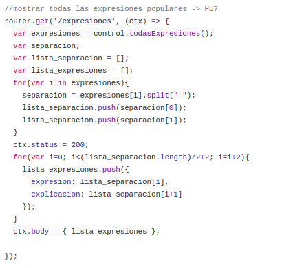

# DESARROLLO DE UNA API-REST USANDO KOA COMO FRAMEWORK
Como vimos en el [anterior documento](https://github.com/irenecj/proyecto-idiomas/blob/master/docs/microservicios/framework-elegido.md), hemos decidido usar como framework Koa, por las razones que ya comentamos ahí.

## CLASE CONTROLADORA
Para realizar un diseño por capas es necesario tener una clase controladora, en nuestro caso se llama [**controller.js**](https://github.com/irenecj/proyecto-idiomas/blob/master/src/controller.js), la cual se encarga del acceso a datos, los cuales recibirá nuestra API y procederá a serializarlos. En esta clase hemos creado un objeto *Idioma* con el cual obtenemos los datos necesarios en función de la Historia de Usuario que estemos tratando.

## RUTAS
El diseño de rutas es fundamental para poder poner en funcionamiento nuestra API y por ello voy a proceder a explicar cada una de las rutas.
En primer lugar necesitamos importar tanto *koa* como *koa-router*, esta última dependencia es necesaria ya que Koa no admite rutas en su módulo principal, por lo tanto, necesitamos un módulo que nos permita crear y manejar dichas rutas. Podemos ver que también hacemos uso de *koa-bodyparser*, esta dependencia se encarga de interpretar y parsear el cuerpo de las solicitudes para que así tener un tratamiento más fácil. Además, necesitamos importar nuestra clase *controladora* ya que es la que nos va a proporcionar las estructuras de datos necesarias.
#### HU1: OBTENER EL LISTADO DE VOCABULARIO COMPLETO
Como su nombre indica, esta historia de usuario tiene como finalidad poder obtener un listado completo que contenga todas las palabras registradas junto con su traducción y significado correspondientes.

El método que necesitamos es *GET* ya que estamos realizando una consulta y nuestra URI será **http://localhost:8080/vocabulario**. Lo siguiente que debemos hacer es, mediante nuestro objeto de la clase controladora, obtener los datos de todas las traducciones que forman el listado, es decir, obtendremos una lista con dichas traducciones que es proporcionada por la función **todasTraducciones()**.
Finalmente, debemos montar nuestro JSON recorriendo todas las traducciones obtenidas y guardándolas con dicho formato, para después poder devolverlas como respuesta a nuestra petición junto con el código de estado 200 para indicar que la petición ha tenido éxito.
**Aclaración:** como ya comentamos en el [otro documento](https://github.com/irenecj/proyecto-idiomas/blob/master/docs/microservicios/framework-elegido.md) Koa hace uso de *context* que es un objeto que es parte de dicho framework y que permite manejadores como *request* y *response*. Por si se quiere curiosear a cerca de aquello a lo que podemos acceder usando *context*, dejo el [enlace](https://devhints.io/koa) a una página que contiene dicho listado.

#### HU2: AÑADIR UNA TRADUCCIÓN NUEVA A NUESTRO LISTADO DE VOCABULARIO

En esta ruta debemos indicar que el método va a ser *POST* ya que vamos a crear un recurso, el cual en nuestro caso está formado por una palabra y su significado. Una vez obtenemos dichos parámetros de la URI usamos nuestra función **nuevaTraduccion(palabra,significado)** de la clase controladora, que añadirá al listado nuestra nueva palabra. Finalmente, al igual que antes, montamos nuestro JSON y lo devolvemos, indicando como código de estado en este caso el 201 indicando que nuestra petición ha tenido éxito y que se ha creado el recurso. La URI correspondiente a esta ruta es **http://localhost:8080/vocabulario/:palabra/:significado**.
**Aclaración:** los parámetros pasados en la URI se indican con ':'.

##### FUNCIONAMIENTO CORRECTO
Para probar el correcto funcionamiento de nuestra API voy a utilizar **Postman** que es una herramienta que se utiliza sobretodo para el testing de API REST.
Lo primero que vamos a hacer es añadir dos palabras y a continuación las mostraremos.

#### HU3: BUSCAR UNA TRADUCCIÓN CONCRETA EN EL LISTADO DE VOCABULARIO
Esta Historia de Usuario está enfocada a permitir que un usuario introduzca la palabra determinada de la cual quiere obtener la traducción.

Como estamos haciendo una consulta volvemos a tener el método *GET* y en esta ocasión los datos son devueltos mediante la función **traduccion(palabra)**, que nos devolverá el significado y traducción correspondientes a dicha palabra. Para terminar, simplemente montamos nuestro JSON con la palabra proporcionada y el significado obtenido, y lo devolvemos junto con el código de estado 200.

##### FUNCIONAMIENTO CORRECTO
Para comprobar que funciona bien vamos a buscar la palabra *INFORMÁTICA*, usando la URI **http://localhost:8080/vocabulario/:palabra**.

#### HU4: MODIFICAR EL SIGNIFICADO / TRADUCCIÓN DE UNA PALABRA CONCRETA
Esta Historia de Usuario nos permite poder modificar el significado o la traducción de la palabra que deseemos.

En este caso, en la URI debemos indicar la palabra a la que queremos cambiarle el significado o la traducción y a continuación el nuevo valor de este último parámetro, obteniendo la siguiente URI: **http://localhost:8080/vocabulario/:palabra/:significadoNuevo**. Además, vamos a tener como método *PUT* ya que vamos a cambiar el estado del recurso.
Una vez captamos el significado nuevo, lo pasamos como parámetro de la función **cambioSignificado(significadoNuevo)** la cual se encargará de modificar el significado correspondiente. Como en el resto de rutas, respondemos con un JSON y 200 como código de estado.

##### FUNCIONAMIENTO CORRECTO
Vamos a cambiar el significado de la palabra *MESA*.

Si ahora mostramos todo el vocabulario, o simplemente buscamos dicha palabra, veremos como efectivamente su significado ha cambiado.

#### HU5: MOSTRAR TRADUCCIONES QUE EMPIEZAN POR UNA DETERMINADA LETRA
Esta Historia de Usuario se basa en mostrarnos aquellas palabras que comiencen por la letra indicada junto con sus traducciones.
Para ello tenemos la URI **http://localhost:8080/vocabulario/filtrar/:letra** de la cual captamos la letra que usaremos para filtrar y el método es *GET* ya que nos encontramos ante una consulta.

A continuación, mediante una llamada a la función **filtrarLetra(letra)** que nos devolverá aquellas traducciones cuya palabra comience por la letra indicada.
Una vez hecho esto, recorremos dichas traducciones y vamos formando nuestro JSON para después devolverlo junto con el código de estado 200.

##### FUNCIONAMIENTO CORRECTO
Vamos a mostrar todas aquellas palabras que comiencen por L en nuestro vocabulario, para ello hemos añadido LUNA, LEER, LAPIZ y LIBRO.

#### HU6: AÑADIR EXPRESIÓN POPULAR
Esta Historia de Usuario, tal y como indica, permite añadir expresiones populares propias del idioma que estamos aprendiendo, en nuestro caso francés. El diseño de la ruta es similar al realizado para la HU2, solo que ahora pasamos como parámetros la expresión y la correspondiente explicación.

#### HU7: MOSTRAR TODAS LAS EXPRESIONES POPULARES
En este caso, vamos a permitir que el usuario pueda obtener un listado con todas las expresiones populares que hay registradas, por tanto el diseño de la ruta ha sido similar al de la HU1 pero con sus parámetros correspondientes.

##### FUNCIONAMIENTO CORRECTO
Vamos a añadir dos expresiones populares y a continuación las mostraremos.

#### HU8: MOSTRAR EL LISTADO DE VOCABULARIO ORDENADO DE MANERA ASCENDENTE O DESCENDENTE
El objetivo de esta Historia de Usuario es permitir al usuario indicar si quiere que el listado de vocabulario se muestre ordenado ascendente o descendentemente.

Para ello hemos definido la URI **http://localhost:8080/vocabulario/ordenar/:orden** y usamos como método *GET*.
Una vez captamos el orden introducido por el usuario, llamamos a la función **ordenarVocab(orden)** que nos devolverá el listado de traducciones ordenados, con el cual generaremos nuestro JSON y ya lo tendremos listo para enviarlo como respuesta.

#### HU9: AÑADIR FRASE COTIDIANA
Esta ruta se ha diseñado igual que las de HU2 y HU6 y permite añadir una frase cotidiana usada en el lenguaje que estamos aprendiendo.

#### HU10: MOSTRAR TODAS LAS FRASES COTIDIANAS POR TIPO
En este caso, vamos a mostrar sólo aquellas frases cotidianas de un tipo específico, el cual nos indicará el usuario. Por tanto, si estamos hablando con alguien y necesitamos una frase que nos permita despedirnos, tendremos que buscar el tipo SALUDO.

Para ello, una vez hemos captado el tipo, llamamos a la función **todasFrases(tipo)** que nos devolverá un listado con las frases clasificadas con dicho tipo, a partir del cual crearemos el JSON correspondiente.

##### FUNCIONAMIENTO CORRECTO
Vamos a añadir dos frases del mismo tipo, en este caso SALUDO, y otra del tipo PRESENTARSE, y vamos a mostrar solo las de tipo SALUDO.

