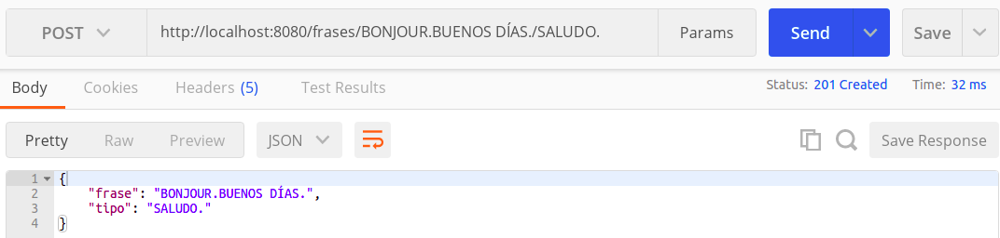

# DESARROLLO DE UNA API-REST USANDO KOA COMO FRAMEWORK
Como vimos en el [anterior documento](https://github.com/irenecj/proyecto-idiomas/blob/master/docs/microservicios/framework-elegido.md), hemos decidido usar como framework Koa, por las razones que ya comentamos ahí.

## CLASE CONTROLADORA
Para realizar un diseño por capas es necesario tener una clase controladora, en nuestro caso se llama [**controller.js**](https://github.com/irenecj/proyecto-idiomas/blob/master/src/controller.js), la cual se encarga del acceso a datos, los cuales recibirá nuestra API y procederá a serializarlos. En esta clase hemos creado un objeto *Idioma* con el cual obtenemos los datos necesarios en función de la Historia de Usuario que estemos tratando.

## RUTAS
El diseño de rutas es fundamental para poder poner en funcionamiento nuestra API y por ello voy a proceder a explicar cada una de las rutas.
En primer lugar necesitamos importar tanto *koa* como *koa-router*, esta última dependencia es necesaria ya que Koa no admite rutas en su módulo principal, por lo tanto, necesitamos un módulo que nos permita crear y manejar dichas rutas. Podemos ver que también hacemos uso de *koa-bodyparser*, esta dependencia se encarga de interpretar y parsear el cuerpo de las solicitudes para que así tener un tratamiento más fácil. Además, necesitamos importar nuestra clase *controladora* ya que es la que nos va a proporcionar las estructuras de datos necesarias.
#### HU1: OBTENER EL LISTADO DE VOCABULARIO COMPLETO
Como su nombre indica, esta historia de usuario tiene como finalidad poder obtener un listado completo que contenga todas las palabras registradas junto con su traducción y significado correspondientes.

El método que necesitamos es *GET* ya que estamos realizando una consulta y nuestra URI será **http://localhost:8080/vocabulario**. Lo siguiente que debemos hacer es, mediante nuestro objeto de la clase controladora, obtener los datos de todas las traducciones que forman el listado, es decir, obtendremos una lista con dichas traducciones que es proporcionada por la función **todasTraducciones()**.
Finalmente, debemos montar nuestro JSON recorriendo todas las traducciones obtenidas y guardándolas con dicho formato, para después poder devolverlas como respuesta a nuestra petición junto con el código de estado 200 para indicar que la petición ha tenido éxito.
**Aclaración:** como ya comentamos en el [otro documento](https://github.com/irenecj/proyecto-idiomas/blob/master/docs/microservicios/framework-elegido.md) Koa hace uso de *context* que es un objeto que es parte de dicho framework y que permite manejadores como *request* y *response*. Por si se quiere curiosear a cerca de aquello a lo que podemos acceder usando *context*, dejo el [enlace](https://devhints.io/koa) a una página que contiene dicho listado.

#### HU2: AÑADIR UNA TRADUCCIÓN NUEVA A NUESTRO LISTADO DE VOCABULARIO

En esta ruta debemos indicar que el método va a ser *POST* ya que vamos a crear un recurso, el cual en nuestro caso está formado por una palabra y su significado. Una vez obtenemos dichos parámetros de la URI usamos nuestra función **nuevaTraduccion(palabra,significado)** de la clase controladora, que añadirá al listado nuestra nueva palabra. Finalmente, al igual que antes, montamos nuestro JSON y lo devolvemos, indicando como código de estado en este caso el 201 indicando que nuestra petición ha tenido éxito y que se ha creado el recurso. La URI correspondiente a esta ruta es **http://localhost:8080/vocabulario/:palabra/:significado**.
**Aclaración:** los parámetros pasados en la URI se indican con ':'.

##### FUNCIONAMIENTO CORRECTO
Para probar el correcto funcionamiento de nuestra API voy a utilizar **Postman** que es una herramienta que se utiliza sobretodo para el testing de API REST.
Lo primero que vamos a hacer es añadir dos palabras y a continuación las mostraremos.

#### HU3: BUSCAR UNA TRADUCCIÓN CONCRETA EN EL LISTADO DE VOCABULARIO
Esta Historia de Usuario está enfocada a permitir que un usuario introduzca la palabra determinada de la cual quiere obtener la traducción.

Como estamos haciendo una consulta volvemos a tener el método *GET* y en esta ocasión los datos son devueltos mediante la función **traduccion(palabra)**, que nos devolverá el significado y traducción correspondientes a dicha palabra. Para terminar, simplemente montamos nuestro JSON con la palabra proporcionada y el significado obtenido, y lo devolvemos junto con el código de estado 200.

##### FUNCIONAMIENTO CORRECTO
Para comprobar que funciona bien vamos a buscar la palabra *INFORMÁTICA*, usando la URI **http://localhost:8080/vocabulario/:palabra**.

#### HU4: MODIFICAR EL SIGNIFICADO / TRADUCCIÓN DE UNA PALABRA CONCRETA
Esta Historia de Usuario nos permite poder modificar el significado o la traducción de la palabra que deseemos.

En este caso, en la URI debemos indicar la palabra a la que queremos cambiarle el significado o la traducción y a continuación el nuevo valor de este último parámetro, obteniendo la siguiente URI: **http://localhost:8080/vocabulario/:palabra/:significadoNuevo**. Además, vamos a tener como método *PUT* ya que vamos a cambiar el estado del recurso.
Una vez captamos el significado nuevo, lo pasamos como parámetro de la función **cambioSignificado(significadoNuevo)** la cual se encargará de modificar el significado correspondiente. Como en el resto de rutas, respondemos con un JSON y 200 como código de estado.

##### FUNCIONAMIENTO CORRECTO
Vamos a cambiar el significado de la palabra *MESA*.

Si ahora mostramos todo el vocabulario, o simplemente buscamos dicha palabra, veremos como efectivamente su significado ha cambiado.

#### HU5: MOSTRAR TRADUCCIONES QUE EMPIEZAN POR UNA DETERMINADA LETRA
Esta Historia de Usuario se basa en mostrarnos aquellas palabras que comiencen por la letra indicada junto con sus traducciones.
Para ello tenemos la URI **http://localhost:8080/vocabulario/filtrar/:letra** de la cual captamos la letra que usaremos para filtrar y el método es *GET* ya que nos encontramos ante una consulta.

A continuación, mediante una llamada a la función **filtrarLetra(letra)** que nos devolverá aquellas traducciones cuya palabra comience por la letra indicada.
Una vez hecho esto, recorremos dichas traducciones y vamos formando nuestro JSON para después devolverlo junto con el código de estado 200.

##### FUNCIONAMIENTO CORRECTO
Vamos a mostrar todas aquellas palabras que comiencen por L en nuestro vocabulario, para ello hemos añadido LUNA, LEER, y LIBRO.

#### HU6: AÑADIR EXPRESIÓN POPULAR
Esta Historia de Usuario, tal y como indica, permite añadir expresiones populares propias del idioma que estamos aprendiendo, en nuestro caso francés. El diseño de la ruta es similar al realizado para la HU2, solo que ahora pasamos como parámetros la expresión y la correspondiente explicación. La URI es **http://localhost:8080/expresiones/:expresion/:explicacion**.

#### HU7: MOSTRAR TODAS LAS EXPRESIONES POPULARES
En este caso, vamos a permitir que el usuario pueda obtener un listado con todas las expresiones populares que hay registradas. La URI es **http://loclahost:8080/expresiones**.

Como vemos, en este caso hemos tenido que separar nuestras expresiones populares en dos partes, realizando dicha separación mediante un guión.
Por tanto, tenemos por un lado la *expresión* y por otro lado la *explicación*. De esta manera, vamos añadiendo a nuestro vector *lista-separación*, cada expresión y cada explicación como elementos separados, de tal forma que cuando vayamos a montar el json de respuesta, tenemos que recorrer dicha *lista_separación* e ir cogiendo los elementos de dos en dos, de manera que, un elemento de *lista_expresiones* corresponderá a un par *expresión-explicación* de *lista_separación*.

##### FUNCIONAMIENTO CORRECTO
Vamos a añadir dos expresiones populares y a continuación las mostraremos.

#### HU8: MOSTRAR EL LISTADO DE VOCABULARIO ORDENADO DE MANERA ASCENDENTE O DESCENDENTE
El objetivo de esta Historia de Usuario es permitir al usuario indicar si quiere que el listado de vocabulario se muestre ordenado ascendente o descendentemente.

Para ello hemos definido la URI **http://localhost:8080/vocabulario/ordenar/:orden** y usamos como método *GET*.
Una vez captamos el orden introducido por el usuario, llamamos a la función **ordenarVocab(orden)** que nos devolverá el listado de traducciones ordenados, con el cual generaremos nuestro JSON y ya lo tendremos listo para enviarlo como respuesta.

##### FUNCIONAMIENTO CORRECTO
Para probar este funcionamiento, previamente hemos añadido las palabras: LUNA, LEER, INFORMÁTICA, LIBRO y MESA.
Primero vamos a ordenar el listado *ascendentemente*:

Ahora de manera *descendente*:

#### HU9: AÑADIR FRASE COTIDIANA
Esta ruta se ha diseñado igual que las de HU2 y HU6 y permite añadir una frase cotidiana usada en el lenguaje que estamos aprendiendo. La URI correspondiente es **http://localhost:8080/frases/:frase/:tipo**.

#### HU10: MOSTRAR TODAS LAS FRASES COTIDIANAS POR TIPO
En este caso, vamos a mostrar sólo aquellas frases cotidianas de un tipo específico, el cual nos indicará el usuario. Por tanto, si estamos hablando con alguien y necesitamos una frase que nos permita despedirnos, tendremos que buscar el tipo SALUDO.
La URI es **http://localhost:8080/frases/:tipo**.

Para ello, una vez hemos captado el tipo, llamamos a la función **todasFrases(tipo)** que nos devolverá un listado con las frases clasificadas con dicho tipo, a partir del cual crearemos el JSON correspondiente.

##### FUNCIONAMIENTO CORRECTO
Vamos a añadir dos frases del mismo tipo, en este caso SALUDO, y otra del tipo PRESENTARSE, y vamos a mostrar solo las de tipo SALUDO.

## REALIZACIÓN DE TESTS
Como hemos hecho en hitos anteriores, todo el código que implementemos debe ser testeado para así evitar que se produzcan fallos.
En este punto del proyecto debemos realizar tests de integración.
¿Por qué realizar dichos tests?
Esto se debe a que las pruebas de integración nos permiten detectar errores antes de proceder a levantar nuestra API y asegurarnos de que todas nuestra rutas funcionan correctamente.

En mi caso, he estado testeando mi proyecto con **Jest**, y ahora para hacer los tests de integración voy a usar **Supertest**.

¿Por qué Supertest?
En primer lugar, he probado esta librería al realizar los ejercicios del tema y me ha resultado bastante cómoda y fácil de entender. Además, se integra muy bien con Jest y tiene una documentación muy completa, permitiendo que implementando muy pocas líneas de código tengamos nuestros tests listos para comenzar a realizar las pruebas de integración.

Para que no resulte muy pesada la documentación, voy a comentar sólo el diseño de algunos tests concretos ya que estos se repiten en las diferentes rutas.
¿Qué debemos testear?
- Que la petición se realiza correctamente, es decir, con código de estado 200 o 201, y que la respuesta devuelta está en formato json.
- Que obtenemos un error 400 (Bad Request) cuando: la palabra/expresión/frase que añadimos ya está registrada, el orden no es *ascendente* ni *descendente*, el tipo de dato no es un *string* o el string no acaba en punto final.
- Que obtenemos un error 404 (Not Found) cuando: la palabra/frase/expresión buscada no existe.

Vamos a comenzar viendo un ejemplo de test de una función cuya petición, *GET* en este caso, se ha realizado con éxito.

Simplemente indicamos que vamos a hacer una petición *GET* a la ruta */vocabulario* y que esta nos debe devolver un json acompañado del código de estado 200.
Este tipo de test se tiene que realizar con todas nuestras consultas tanto con *GET* y *PUT*, que tendrán como código de estado el 200, y con *POST*, cuyo código de estado será el 201.

A continuación, veremos un ejemplo en el que obtendremos un error 400.

Podemos observar, que el primer test se encarga de añadir una frase, tal y como hemos indicado antes, y seguidamente procedemos a añadir esta misma frase. Cuando esto ocurre, volvemos a devolver un json pero esta vez irá acompañado del código de estado 400, ya que la frase que se pretende añadir ya está previamente registrada.

Por otro lado, tenemos el error 404.

Antes de este test, hemos realizado otro con el que hemos añadido la palabra *INFORMÁTICA*, por tanto, nuestro primer test que filtra por la letra *I*, devolverá un json con dicha palabra junto con su significado y el código de estado 200. Sin embargo, si pretendemos filtrar por la letra *M*, como no hay ninguna palabra que empiece por dicha letra, vamos a devolver un json con el código de estado 404.

En cuanto al testeo del formato de los datos proporcionados, he decidido hacer un sólo test ya que me parecía poco eficiente repetir dicho test en todas las rutas diseñadas, ya que si nos funciona en una de ellas funcionará en el resto debido a la simple implementación de dichos métodos, que se basan en captar el dato y comprobar que se ajusta al formato que deseamos.

El primer test nos devolverá un error 400 ya que, en este caso, la palabra no termina en punto y final, por tanto no tiene un formato correcto. El siguiente test, evalúa que los datos que pasamos son de tipo *string*, entonces, como pasamos un *entero* vamos a devolver un error 400.

Finalmente, nos cercioramos que cuando introducimos una URI la cual no hemos diseñado se nos devolverá un error 404.

Como ya sabemos, la ruta */traducciones* no es una ruta que hayamos creado, por tanto debemos devolver el error 404.
Aquí cabe destacar que no devolvemos un json, esto se debe a que para comprobar que una ruta no se encuentra entre las diseñadas utilizamos un middleware proporcionado por Koa, y dicho middleware nos devuelve la respuesta en texto plano.
