# JUSTIFICACIÓN DEL FRAMEWORK ELEGIDO PARA EL MICROSERVICIO
Para poder escoger un framework para nuestro microservicio vamos a basarnos en dos aspectos técnicos: resultados de los tests de rendimiento y características de cada framework.

## FRAMEWORKS SELECCIONADOS
Después de documentarme sobre frameworks para NodeJS, he llegado a la conclusión de que las alternativas entre las que debe estar nuestra elección son las siguientes:
- Hapi JS
- Koa
- Restify JS

**Aclaración:** en esta lista también podría incluirse Express JS, sin embargo, al ser el framework escogido para la realización de los ejemplos del guión y para llevar a cabo los ejercicios propuestos, he decidido descartarlo para así probar otro framework diferente.

## CARACTERÍSTICAS DE CADA FRAMEWORK
A parte de basarnos en los tests de rendimiento también debemos valorar las características que presenta cada framework y ver cuál de ellos se ajusta más a nuestras necesidades.
#### HAPI JS
- Posee una gran comunidad y su repositorio está muy activo.
- Tiene una gran cantidad de plugins y librerías que resuelven problemas comunes y que además, permiten separar la aplicación en trozos de código aislados.
- Uno de los plugins que tiene, llamado **Joi** permite validar los parámetros enviados permitiendo notificar al cliente si introduce mal uno de dichos datos, por ejemplo, si debe introducir el nombre de una persona y en su lugar nos introduce un entero.
- La gestión de rutas es muy sencilla.
- Incluye manejo de cookies sin necesidad de tener que instalar un plugin para ello.
- Realización de tests no muy complicada importando **@hapi/lab**.

#### KOA
- Gran comunidad y documentación muy extensa.
- Es una versión mejorada de Express y se diferencia de este por ser más ligero, más rápido y más solido.
- Usa **async/await** que mejora la lectura del código.
- El manejo de errores es más fino y con un solo middleware sería suficiente para manejarlos y solventarlos.
- Gestión de rutas relativamente sencilla y bien documentada.
- Permite el uso de middlewares simplemente indicando **app.use**. Si queremos poder hacer peticiones debemos importar **koa-route**.
- Permite el uso de objetos que contienen propiedades útiles de Koa, mediante el **context**, al que nos referimos como **ctx**. Entre dichas propiedades nos encontramos *request*, *response*, *state* recomendado para pasar datos entre middlewares, *cookies*, que es una instancia de paquete de cookies, permitiendo agregar y obtener cookies firmadas, *throw*, para lanzar errores, entre otros.
- Permite testeo con *Jest* y *Supertest*.

#### RESTIFY
- Documentación completa aunque en ocasiones es un poco difícil dar con ella.
- Gestión de rutas relativamente sencilla y bien documentada.
- Proporciona un módulo, llamado **resitfy-errors** para gestionar los diferentes errores.
- Realización de tests más compleja que con el resto de frameworks.

#### CONCLUSIONES OBTENIDAS A PARTIR DE LAS CARACTERÍSTICAS ENCONTRADAS
Viendo las características que dichos frameworks presentan me surgen dudas en si elegir **Koa** o **Hapi**, aunque la balanza se decanta un poco más por Koa ya que me parece que puede ser más eficiente y ajustarse más a mi proyecto.
Como no estoy muy segura de dicha elección vamos a realizar una serie de tests de rendimiento y finalmente obtendremos una elección final.

## TESTS DE RENDIMIENTO
Para llevar a cabo dichos tests me he estado informando y he encontrado una herramienta llamada **Artillery**, la cual viene implementada en NodeJS y cuya función es muy similar a la realizada con **JMeter** o **Apache Benchmark**. La documentación usada ha sido la [siguiente.](https://www.adictosaltrabajo.com/2018/02/22/tests-de-rendimiento-con-artillery/)

Lo primero que debemos hacer es instalar la herramienta mediante el siguiente comando:
~~~
npm install -g artillery
~~~

Y a continuación procedemos a lanzar peticiones a nuestra URL. Estas peticiones son muy facilitas y consisten en devolver un *Hello world*.
Dicha herramienta posee el comando **quick** que permite lanzar un test rápido contra la URL que hayamos indicado. En nuestro caso vamos a simular que tenemos 100 usuarios los cuales envían 50 peticiones cada uno, por tanto el comando resultante sería el siguiente:
~~~
artillery quick --count 100 -n 50 http://127.0.0.1:8080
~~~

#### HAPI JS
En primer lugar, facilitamos el enlace a la [página oficial](https://hapi.dev/) donde podemos encontrar la documentación y el comando necesario para instalar el framework.
~~~
npm install @hapi/hapi
~~~

El fichero creado para hacer las pruebas es el siguiente:

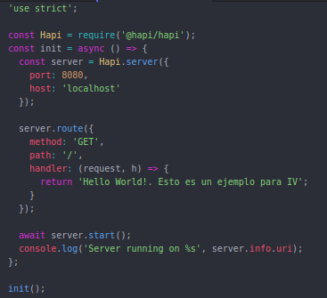

Lo primero que hacemos es establecer cual va a ser el puerto en el que escuchará nuestro servidor e indicar que vamos a hacer las peticiones al localhost. Una vez hecho esto, definimos una ruta a la página principal y mostramos nuestro *Hello World*. Como vemos, estamos haciendo uso de una función asíncrona, y una vez establecemos la función debemos arrancar el servidor y mostrar un mensaje para saber que efectivamente estamos en la URI indicada.

Podemos comprobar que funciona correctamente:

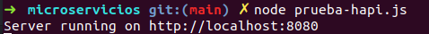

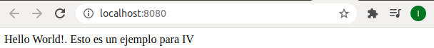

Y ahora vamos a ver los resultados obtenidos en el test de rendimiento:

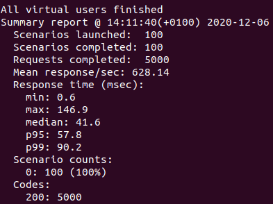

Como vemos se han realizado 5000 peticiones y todas han tenido éxito, ya que se han devuelto 5000 códigos de estado 200. Por otro lado, nos vamos a quedar con estos resultados:
- Peticiones por segundo = 628'14
- Tiempo máximo transcurrido entre todos (en ms) = 146'9
- Media de tiempo transcurrido por respuesta: 41'6

#### KOA
Nos hemos basado en la [página oficial](https://koajs.com/) para poder llevar a cabo el fichero de ejemplo.
Primero debemos proceder a instalar el framework:
~~~
npm install install koa

npm install koa-router
~~~

Y a continuación creamos nuestro *Hello World*.

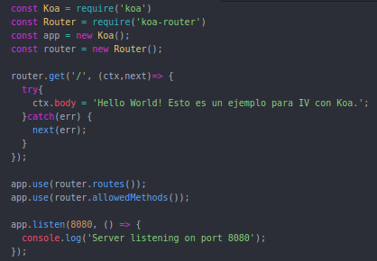

En este fichero, lo primero que llama la atención es que importamos tanto **koa** como **koa-router**, esto se debe a que el módulo **koa-router** es el que nos permite usar los métodos GET, POST, PUT y DELETE entre otros.
A continuación establecemos nuestra ruta en la cual mostraremos el *Hello World* y cabe destacar que *ctx* es el objeto del que hemos hablado en las características de Koa y mediante el cual mandaremos la respuesta.

A continuación, tenemos un middleware que se encargará de devolver la ruta correspondiente a la solicitud realizada y otro que verificará que el método sea correcto, es decir, si nosotros hemos establecido el path */ruta* como GET, si el usuario intenta hacer una petición POST en dicho path automáticamente saltará un error.
Podemos comprobar esto usando una extensión de Chrome, llamada **Postman**, con la cual podemos lanzar peticiones HTTP. Aclarar, que puede probarse en el navegador como acostumbramos, simplemente aquí se ve más claro.

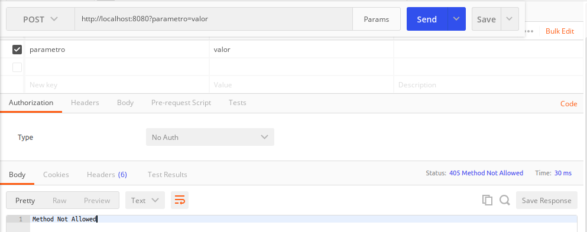

Vemos que directamente nos indica un error 405, que significa que el método no está permitido, ya que hemos definido nuestra ruta como GET, no como POST.

Y comprobamos que funciona correctamente:

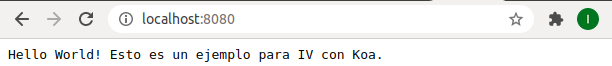

Pasamos a ver los resultados obtenidos en el test de rendimiento:

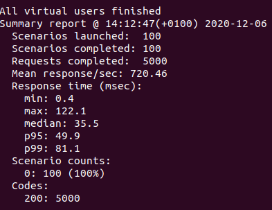

Como vemos, al igual que antes las 5000 peticiones se han realizado con éxito y los datos que nos interesan son los siguientes:
- Peticiones por segundo = 720'46
- Tiempo máximo transcurrido entre todos (en ms) = 122'1
- Media de tiempo transcurrido por respuesta = 35'5

#### RESTIFY JS
Aquí tenemos la [documentación seguida](https://www.npmjs.com/package/restify) sobre dicho framework. Pasamos a instalarlo:
~~~
npm install restify
~~~

Al igual que antes, creamos el fichero de prueba y vemos que funciona correctamente.

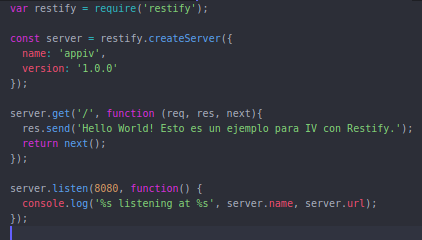

Comenzamos dándole un nombre a nuestro servidor e indicando una versión del mismo. Hecho esto, establecemos nuestra ruta y respondemos con un mensaje. Finalmente, indicamos en qué puerto vamos a estar escuchando.

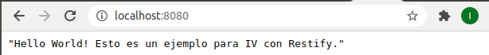

Una vez hecho esto realizamos el test de rendimiento:

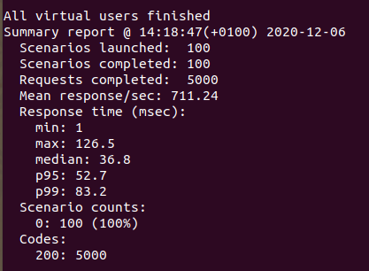

Volvemos a tener un 100% de éxito y respecto al resto de datos tenemos:
- Peticiones por segundo = 711'24
- Tiempo máximo transcurrido entre todos (en ms) = 126'5
- Media de tiempo transcurrido por respuesta = 36'8

#### CONCLUSIÓN OBTENIDA RESPECTO A TEST DE RENDIMIENTO
En lo que respecta a **peticiones por segundo**, vemos que el framework que nos presenta un mayor resultado es Koa, seguido de Restify.
En cuanto a **tiempo máximo transcurrido**, vemos que vuelve a ser Koa quien presenta un tiempo menor, esto quiere decir, que la petición que más ha tardado en ser respondida ha presentado un tiempo de 122'1 ms.
Y por último, si nos fijamos en la **media de tiempo transcurrido por respuesta**, vemos que Koa también obtiene el menor resultado, frente a Hapi que nos proporciona el peor tiempo.

Por tanto, si nos basamos en los tests de rendimiento, vemos que el framework con mejores resultados es **Koa** y el que proporciona peores resultados es **Hapi**.

## ELECCIÓN FINAL
Como hemos comentado al principio, **Koa** y **Hapi** parecían ser los frameworks que más se iban a ajustar a nuestro proyecto pero además, hemos visto que en lo que respecta a rendimiento **Koa** ha presentado mejores resultados que **Hapi**, por lo que, por todos estos motivos presentados y justificados **decido usar Koa como framework para el desarrollo del proyecto.**
