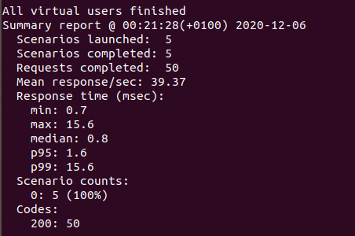

# JUSTIFICACIÓN DEL FRAMEWORK ELEGIDO PARA EL MICROSERVICIO
Para poder escoger un framework para nuestro microservicio vamos a basarnos en dos aspectos técnicos: resultados de los tests de rendimiento y características de cada framework.

## FRAMEWORKS SELECCIONADOS
Después de documentarme sobre frameworks para NodeJS, he llegado a la conclusión de que las alternativas entre las que debe estar nuestra elección son las siguientes:
- Hapi JS
- Andonis JS
- Koa

**Aclaración:** en esta lista también podría incluirse Express JS, sin embargo, al ser el framework escogido para la realización de los ejemplos del guión y para llevar a cabo los ejercicios propuestos, he decidido descartarlo para así probar otro framework diferente.

## TESTS DE RENDIMIENTO
Para llevar a cabo dichos tests me he estado informando y he encontrado una herramienta llamada **Artillery**, la cual viene implementada en NodeJS y cuya función es muy similar a la realizada con **JMeter** o **Apache Benchmark**. La documentación usada ha sido la [siguiente.](https://www.adictosaltrabajo.com/2018/02/22/tests-de-rendimiento-con-artillery/)

Lo primero que debemos hacer es instalar la herramienta mediante el siguiente comando:
~~~
npm install -g artillery
~~~

Y a continuación procedemos a lanzar peticiones a nuestra URL. Estas peticiones son muy facilitas y consisten en devolver un *Hello world*.
Dicha herramienta posee el comando **quick** que permite lanzar un test rápido contra la URL que hayamos indicado. En nuestro caso vamos a simular que tenemos 5 usuarios los cuales envían 10 peticiones cada uno, por tanto el comando resultante sería el siguiente:
~~~
artillery quick --count 5 -n 10 http://127.0.0.1:8080
~~~

#### HAPI JS
En primer lugar, facilitamos el enlace a la [página oficial](https://hapi.dev/) donde podemos encontrar la documentación y el comando necesario para instalar el framework.
~~~
npm install @hapi/hapi
~~~

El fichero creado para hacer las pruebas es el siguiente:

Podemos comprobar que funciona correctamente:

Y ahora vamos a ver los resultados obtenidos en el test de rendimiento:

Como vemos se han realizado 50 peticiones y todas han tenido éxito, ya que se han devuelto 50 códigos de estado 200. Por otro lado, nos vamos a quedar con estos dos resultados:
- Peticiones por segundo = 39'37
- Tiempo máximo transcurrido (en ms) = 15'6
- Media de tiempo transcurrido por respuesta: 0'8

#### KOA
