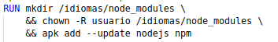
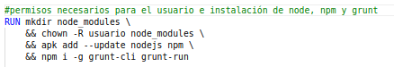
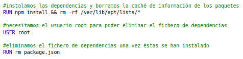

# OPTIMIZACIÓN DE LA IMAGEN OBTENIDA
En primer lugar, como ya hemos visto en las [pruebas realizadas](https://github.com/irenecj/proyecto-idiomas/blob/master/docs/pruebas-docker.md) la imagen que hemos elegido es *Alpine* ya que nos proporciona una imagen muy pequeña.
En este punto, la optimización reside en que hemos decidido elegir *Alpine* como sistema operativo en lugar de la imagen oficial de Node, *node:14-alpine3.10*, ya que vimos que esta última nos proporcionaba una imagen mayor:
- **Alpine:** 117MB
- **Node:14-alpine3.10:** 165MB

En páginas como la [siguiente](https://picodotdev.github.io/blog-bitix/2017/04/imagenes-de-docker-con-alpine-linux/) vemos que se comenta que Alpine apenas contiene paquetes innecesarios.
En esta otra [página]() se mencionan ciertos aspectos a tratar para optimizar imágenes en Docker:
- **Utilizar la menor cantidad de layers posibles:** en nuestro caso, hemos agrupado los conjuntos de instrucciones en el menor número de layers posibles, como por ejemplo:

  
- **Reducir espacio eliminando archivos temporales o cosas que no son necesarias:** hemos borrado el *package.json* una vez instaladas las dependencias y también hemos eliminado la caché de información de los paquetes. Además, hemos instalado sólo aquello que necesitamos, es decir *npm*, *node* y *grunt*, junto con los paquetes que trae Alpine, que ya hemos mencionado que no son muchos.

  

  
- **Optimizar el archivo ".dockerignore", indicando qué ficheros temporales y logs deben ignorarse:** en nuestro *.dockerignore* hemos añadido 'node_modules' y 'npm-debug.log'.

  
