# PRUEBAS Y DECISIÓN SOBRE CONTENEDOR BASE
Para proceder a la elección de un contenedor base nos vamos a basar en dos criterios técnicos: el tiempo que tardan los contenedores en ejecutar los tests, y el tiempo que tardan en descargarse junto con su tamaño final.

Basándome en los [repositorios oficiales]() he decidido probar con las siguientes imágenes:
- **node:15.0**
- **node:15.0-alpine3.10**
- **node:15.0-slim**

Con los siguientes comandos podemos ver cuánto tarda en descargarse el contenedor y cuál es el tamaño de cada imagen.
~~~
time docker pull [nombre-imagen]

docker images
~~~

Y los resultados que obtenemos son:
- **node:15.0**
  - Tiempo de descarga de la imagen oficial: 24.35s
  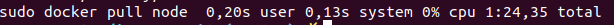
  - Tiempo de construcción de la imagen: 35.456s
  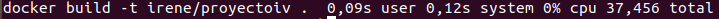
  - Tamaño de nuestra imagen después de construir: 1.07GB
  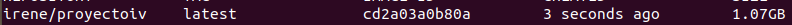
  - Tiempo en ejecutar los tests: 1.805s
  

- **node:15.0-alpine3.10**

  - Tiempo de descarga de la imagen oficial: 15.280s
  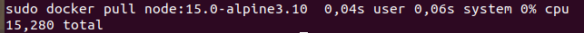
  - Tiempo de construcción de la imagen: 34.695s
  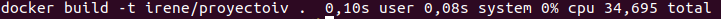
  - Tamaño de nuestra imagen después de construir: 170MB
  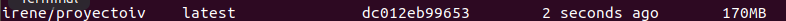
  - Tiempo en ejecutar los tests: 1.913s
  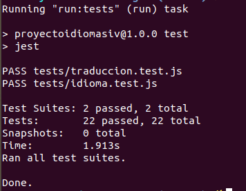

- **node:15.0-slim**
  - Tiempo de descarga de la imagen oficial: 17.016s
  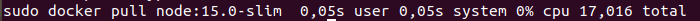
  - Tiempo de construcción de la imagen: 38.668s
  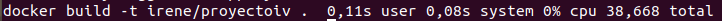
  - Tamaño de nuestra imagen después de construir: 296MB
  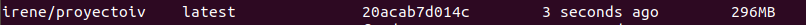
  - Tiempo en ejecutar los tests: 1.827s
  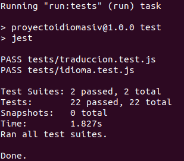

Dentro de cada criterio de mejor a peor tenemos:
- **Descarga:** Alpine > Slim > Node
- **Construcción:** Alpine > Node > Slim
- **Tamaño:** Alpine > Slim > Node
- **Tests:** Node > Slim > Alpine

Como vemos, *Alpine* resulta tener tanto el mejor tiempo de descarga como de construcción y además obtenemos una imagen final con un tamaño muy reducido.
La imagen con menor tiempo en ejecutar los tests es *Node:15*, sin embargo esta nos proporciona una imagen final con un tamaño demasiado grande y además es la más lenta en cuanto a la descarga.
Finalmente, *Slim* es la que mayor tiempo de construcción tiene y no llega a ser la mejor en ninguno de los otros 3 criterios.

Viendo estos resultados y la comparativa, he decidido decantarme por **node:15.0-alpine3.10** ya que en general es la que mejores resultados presenta y la diferencia en el tiempo de ejecución de los tests que presenta frente a las otras imágenes es relativamente pequeña.
