# PRUEBAS Y DECISIÓN SOBRE CONTENEDOR BASE
Para proceder a la elección de un contenedor base nos vamos a basar en 3 criterios técnicos: el tiempo que tardan los contenedores en ejecutar los tests, y el tiempo que tardan en descargarse junto con su tamaño final.
Igual un contenedor tarda mucho en descargarse pero ejecuta los tests bastante rápido, ¿cuál nos interesa más?, esta es la pregunta que vamos a resolver baśandonos en pruebas.

## PRUEBAS CON REPOSITORIOS OFICIALES
Basándome en los [repositorios oficiales](https://hub.docker.com/_/node) he decidido probar con las siguientes imágenes:
- **node:<version>**: es la imagen por defecto de node, suele ser la que más pesa, y puede ser utilizada para montar el código fuente e iniciar el contenedor, como para ser la base para construir otras imágenes.
- **node:<version>-alpine**: se basa en Alpine Linux y es la que genera imágenes más pequeñas.
- **node:<version>-slim**: sólo contiene los paquetes mínimos necesarios para ejecutar *node*.

#### VERSIÓN 15
Con los siguientes comandos podemos ver cuánto tarda en descargarse el contenedor, construimos nuestra imagen, vemos cuál es el tamaño de nuestra imagen después de construir y ejecutamos los tests:
~~~
time docker pull [nombre-imagen]

time docker build -t irene/proyectoiv .

docker images

time docker run irene/proyectoiv
~~~

- **node:15.0**
  - Tiempo de descarga de la imagen oficial: 24,35s
    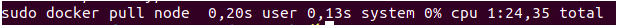
  - Tamaño de nuestra imagen después de construir: 1.07GB
    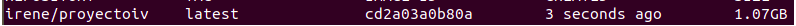
  - Tiempo en ejecutar los tests: 1,805s.

    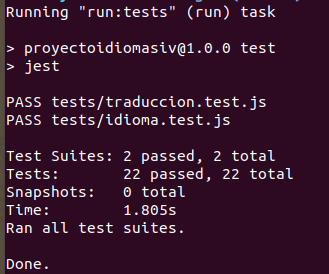

- **node:15.0-alpine3.10**
  - Tiempo de descarga de la imagen oficial. 15,280s
    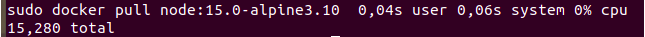
  - Tamaño de nuestra imagen después de construir: 170MB
    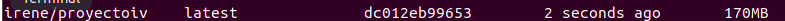
  - Tiempo en ejecutar los tests: 1,913s

    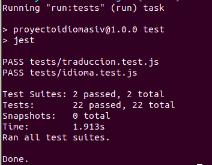

- **node:15.0-slim**
  - Tiempo de descarga de la imagen oficial: 17.016s
    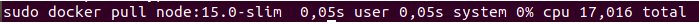
  - Tamaño de nuestra imagen después de construir: 170MB
    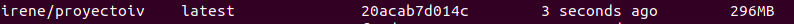
  - Tiempo en ejecutar los tests: 1,827s

    

## PRUEBAS CON REPOSITORIOS OFICIALES

#### VERSIÓN 14
A continuación, vamos a realizar pruebas con los mismos repositorios oficiales pero cambiando la versión de la 15 a la 14.

Y los resultados que obtenemos son:
- **node:14.0**
  - Tiempo de descarga de la imagen oficial: 14,358s

    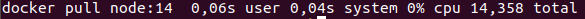

  - Tamaño de nuestra imagen después de construir: 992MB
  
  - Tiempo en ejecutar los tests: 5,258s

    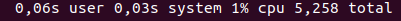

- **node:14.0-alpine3.10**

  - Tiempo de descarga de la imagen oficial: 17,464s
  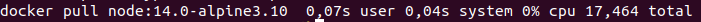
  - Tamaño de nuestra imagen después de construir: 165MB
  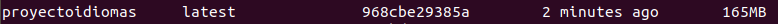
  - Tiempo en ejecutar los tests: 5,503s

    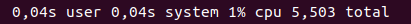

- **node:14.0-slim**
  - Tiempo de descarga de la imagen oficial: 21,253s
  
  - Tamaño de nuestra imagen después de construir: 214MB
  
  - Tiempo en ejecutar los tests: 5,329s

    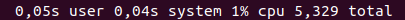

#### VERSIÓN 14 vs VERSIÓN 15
Una vez hechas las pruebas, vemos que la principal diferencia entre ambas versiones es que la versión 15 ejecuta más rápido los tests, sin embargo, la versión 14 genera imágenes un poco más pequeñas.
Pese a esto, he tenido que descartar el uso de la versión 15 de node ya que ésta presentaba dificultades a la hora de usar de forma correcta ciertos paquetes, y esto daba lugar a numerosos errores, de los cuales varios de ellos no he sido capaz de solucionar después de muchas horas investigando y probando.

## IMAGEN BASE MÁS ADECUADA DE LAS ELEGIDAS EN LOS REPOSITORIOS OFICIALES
Dentro de cada criterio de mejor a peor tenemos:
- **Descarga:** Node14 > Alpine > Slim
- **Tamaño:** Alpine > Slim > Node14
- **Tests:** Node14 > Slim > Alpine

Como vemos, *Node:14* tiene tanto el menor tiempo de descarga como la ejecución más rápida de los tests, sin embargo, nos proporciona una imagen cuyo tamaño es muy grande, por tanto descartamos esta opción.
En cuanto a *Alpine* y *Slim* vemos que sus tiempos de ejecución de los tests son muy parecidos, la diferencia entre ellos es muy pequeña, y que además, *Alpine* nos proporciona la imagen más pequeña entre todas las obtenidas y su tiempo de descarga es menor que el de la versión *Slim*. Por todo esto, he preferido, dentro de las imágenes oficiales, **decantarme por Alpine ya que prefiero tener una imagen lo más pequeña posible y un tiempo de ejecución de tests pequeño.**

## IMAGEN BASE A PARTIR DE UN SISTEMA OPERATIVO
Los sistemas operativos con los que voy a probar son **Alpine:3.10.5** y **Ubuntu:20.10**.
En ambos casos necesitaremos instalar todo aquello necesario para ejecutar nuestra aplicación, es decir, para ejecutar los tests. Por tanto, corre de nuestra cuenta instalar *npm* y *node*.

#### ALPINE LINUX
Como ya he mencionado en el [documento anterior](https://github.com/irenecj/proyecto-idiomas/blob/master/docs/intro-Docker.md) vamos a usar Alpine como sistema operativo ya que destaca por proporcionar imágenes muy pequeñas y esto siempre es un punto a favor.
Los resultado obtenidos son:
- Tiempo de descarga de la imagen: 4,048s
  
- Tamaño de nuestra imagen después de construir: 117MB
  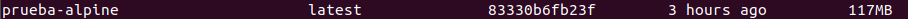
- Tiempo en ejecutar los tests: 5,541s

  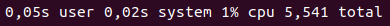

### UBUNTU
A continuación vamos a probar **Ubuntu:20.10** y veremos los resultados obtenidos.
- Tiempo de descarga de la imagen: 16,642s
  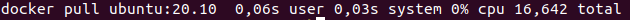
- Tamaño de nuestra imagen después de construir: 744MB
  
- Tiempo en ejecutar los tests: 10.171s

  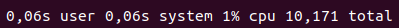

Entre estas dos imágenes, considero que la decisión está clara ya que *Ubuntu* nos proporciona una imagen muy grande y además tarda mucho en ejecutar los tests, por lo que nos **decantamos por Alpine Linux**

## DECISIÓN FINAL
Para tomar la última decisión y ver que imagen vamos a usar para nuestro proyecto debemos comparar la dos imágenes que hemos escogido. Veamos en una tabla cuales son los resultados obtenidos:

|  | Tiempo descarga | Tamaño imagen | Ejecución test |
| -- | -- | -- | -- |
| **node:14-alpine3.10**| 17,464s | 165MB | 5,503s |
| **alpine:3.10.5** | 4,048s | 117MB | 5,541s |

Nos fijamos en los dos aspectos que vamos a considerar más relevantes a la hora de decidirnos, que son *tamaño de la imagen obtenida*, ya que queremos una imagen lo más pequeña posible, y *tiempo de ejecución de los tests*, ya que queremos que los tests se ejecuten lo más rápido posible.
Como vemos, ambas opciones están muy igualadas en estos aspectos, pero *alpine:3.10.5* nos ofrece una imagen más pequeña, y su tiempo de ejecución de los tests no se aleja prácticamente nada del tiempo que tarda la opción *node:14-alpine3.10*.

Por todo esto, considero que lo más adecuado es que escojamos **alpine:3.10.5** como imagen para nuestro contenedor base.
