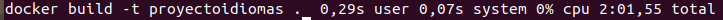
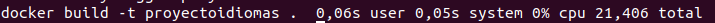

# PRUEBAS Y DECISIÓN SOBRE CONTENEDOR BASE
Para proceder a la elección de un contenedor base nos vamos a basar en dos criterios técnicos: el tiempo que tardan los contenedores en ejecutar los tests, y el tiempo que tardan en descargarse junto con su tamaño final.

Basándome en los [repositorios oficiales](https://hub.docker.com/_/node) he decidido probar con las siguientes imágenes:
- **node:14.0**
- **node:14.0-alpine3.10**
- **node:14.0-slim** 

**Aclaración:** en un principio comencé probando con la versión 15 pero esta me dió diversos problemas a la hora de usar el gestor de tareas.

Con los siguientes comandos podemos ver cuánto tarda en descargarse el contenedor, construimos nuestra imagen, vemos cuál es el tamaño de nuestra imagen después de construir y ejecutamos los tests:
~~~
time docker pull [nombre-imagen]

time docker build -t irene/proyectoiv .

docker images

time docker run irene/proyectoiv
~~~

Y los resultados que obtenemos son:
- **node:14.0**
  - Tiempo de descarga de la imagen oficial: 14,358s

    
  - Tiempo de construcción de la imagen: 1min55s
  
  - Tamaño de nuestra imagen después de construir: 992MB
  
  - Tiempo en ejecutar los tests: 5,258s

    

- **node:14.0-alpine3.10**

  - Tiempo de descarga de la imagen oficial: 17,464s
  
  - Tiempo de construcción de la imagen: 22,764s
  
  - Tamaño de nuestra imagen después de construir: 165MB
  
  - Tiempo en ejecutar los tests: 5,503s

    

- **node:14.0-slim**
  - Tiempo de descarga de la imagen oficial: 21,253s
  
  - Tiempo de construcción de la imagen: 21,406s
  
  - Tamaño de nuestra imagen después de construir: 214MB
  
  - Tiempo en ejecutar los tests: 5,329s

    

Dentro de cada criterio de mejor a peor tenemos:
- **Descarga:** Node14 > Alpine > Slim
- **Construcción:** Slim > Alpine > Node14
- **Tamaño:** Alpine > Slim > Node14
- **Tests:** Node14 > Slim > Alpine

Como vemos, *Node:14* tiene tanto el menor tiempo de descarga como la ejecución más rápida de los tests, sin embargo, nos proporciona una imagen cuyo tamaño es muy grande y además tarda mucho en construirse, por tanto descartamos esta opción.
En cuanto a *Alpine* y *Slim* vemos que sus tiempos de ejecución de los tests son muy parecidos, la diferencia entre ellos es muy pequeña, y que además, *Alpine* nos proporciona la imagen más pequeña entre todas las obtenidas. La opción *Slim* podría destacar en su tiempo de construcción pero en mi caso he preferido **decantarme por Alpine ya que prefiero tener una imagen lo más pequeña posible y un tiempo de ejecución de tests pequeño.**
