# DESPLIEGUE DEL PROYECTO CON NETLIFY
Netlify es una plataforma que permite implementar sitios web estáticos y me he decantado por ella por varios motivos:
- **Facilidad de uso**: Netlify es fácil de usar y su interfaz resulta cómoda.
- **Desarrollo continuo**: esta función la podemos aprovechar para llevar a cabo implementaciones de Git, como es nuestro caso. Al tener asociada nuestra cuenta de GitHub junto con el correspondiente repositorio, cada vez que hagamos **push** se despleagrá nuestro sitio.

Lo primero que debemos hacer es registrarnos en dicha plataforma con nuestra cuenta de GitHub, lo cual he explicado en el [ejercicio 3](https://github.com/irenecj/ejercicios-autoevaluacion-IV/blob/main/TEMA5/ejerciciosIV-Tema5.md) del tema, indicando en la configuración del proyecto que nuestras funciones van a encontrarse en el directorio [**functions**](https://github.com/irenecj/proyecto-idiomas/tree/master/functions) e indicándolo también en un fichero [**netlify.toml**](https://github.com/irenecj/proyecto-idiomas/blob/master/netlify.toml), el cual ubicaremos en la raíz de nuestro proyecto.

Para hacer uso de esta plataforma, decidí comenzar haciendo una función que estuviera relacionada con mis historias de usuario, por tanto decidí implementar una función *que nos permita buscar una palabra concreta*, la cual está relacionada con nuestra [HU3:Consultar una palabra concreta.](https://github.com/irenecj/proyecto-idiomas/issues/17)

Una vez implementé dicha función y tomé contacto con Netlify proseguí desplegando el [bot de Telegram.](https://t.me/YourVocab_bot)

## FUNCIÓN PARA BUSCAR UNA PALABRA CONCRETA
En primer lugar, debemos destacar que la implementación de funciones en **Netlify** es muy similar a la de **Vercel**, y dicho esto, comenzamos a analizar nuestro código.

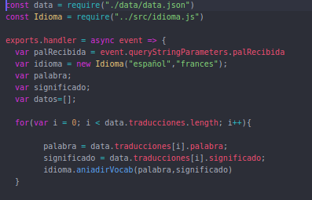

Al igual que en Vercel, necesitamos exportar los datos desde *data.json* y la clase *idioma.js*.
A continuación declaramos todas las variables que vamos a utilizar:
- **palRecibida:** es la palabra que captaremos de la URL y aquella sobre la mostraremos el significado y la traducción.
- **idioma:** usaremos esta variable para poder utilizar las funciones de dicha clase.
- **palabra:** usada para añadir a nuestro listado las palabras.
- **significado:** usada para añadir a nuestro listado los significados de las palabras anteriores.

Lo próximo que tenemos que hacer es recorrer nuestro diccionario de traducciones e ir añadiendo cada palabra con su significado llamando a la función **aniadirVocab(palabra,significado)**, que creará un listado con dichas traducciones.

Ahora necesitamos una variable **resultado** donde almacenaremos, como bien dice su nombre, el resultado que vamos a devolver, y otra, llamada **formatoValido**, con la que comprobaremos haciendo uso de la función **comprobarFormato(cadena)** que la palabra que ha introducido el usuario cumple el requisito de acabar en punto final. Además, necesitamos que la palabra cumpla otro requisito y éste es que esté escrita en mayúsculas.

Si el formato no es válido, notificaremos al usuario y le diremos cual es el formato correcto. En caso contrario, declaramos una variable donde vamos a guardar la posición en la que coincidan la palabra que hemos recibido, con una palabra de nuestro fichero json, ya que esto nos indicará que nos encontramos con la palabra buscada.
Si dicha posición es igual a -1 significa que la palabra que el usuario quiere buscar no se encuentra en nuestro listado, por lo que se lo notificaremos. En caso contrario, simplemente debemos guardar en la variable **resultado** la palabra buscada junto con su significado, y esto es lo que vamos a devolver como respuesta a la petición.

Finalmente vamos a hacer diversas pruebas:
- Probamos introduciendo la palabra 'mesa' con el formato válido, y vemos el resultado en este [enlace.](https://proyecto-idiomas.netlify.app/.netlify/functions/listado?palRecibida=MESA.)

  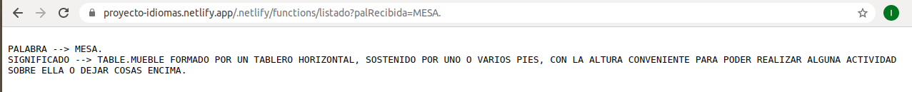

- Probamos introduciendo la palabra 'mesa' con un formato NO válido, y vemos el resultado en este [enlace.](https://proyecto-idiomas.netlify.app/.netlify/functions/listado?palRecibida=mesa.)

  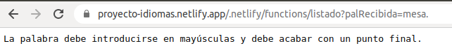

- Probamos introduciendo una palabra que no se encuentra en el listado, y vemos el resultado en este [enlace.](https://proyecto-idiomas.netlify.app/.netlify/functions/listado?palRecibida=COLACAO.)

  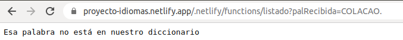

## BOT DE TELEGRAM

#### FICHEROS NECESARIOS
Para desarrollar nuestro Bot de Telegram hacemos uso de dos ficheros:
- **bot.js**: contiene las funciones que son necesarias para generar una respuesta acorde a la petición del usuario y lo encontramos [aquí.](https://github.com/irenecj/proyecto-idiomas/blob/master/functions/bot.js)
  - **listadoVocab()**: devuelve un listado formado por todas las palabras registradas junto con su significado.
  - **palabraConcreta(palabra)**: si la palabra buscada se encuentra en el listado nos devolverá dicha palabra con su significado, en caso contrario, nos notificará si es que la palabra no se encuentra en el listado o si no la hemos metido con el formato adecuado.
  - **cambiarSignificado(palabra, significado)**: permite que el usuario cambie el significado de la palabra que desee mientras esta se encuentre en el listado.
  - **clasifLetra(letra)**: devuelve un listado de palabras que comienzan por la letra que el usuario proporcione.
  - **listadoExpresiones()**: devuelve un listado con todas las expresiones populares que hay registradas.
  - **listadoFrases()**: devuelve un listado con todas las frases cotidianas que hay registradas.
- **index.js**: este fichero gestiona las tareas que va a realizar nuestro bot, es decir, en el indicamos los comandos que hay disponibles y la respuesta que éstos deben devolver. Este fichero se encuentra [aquí.](https://github.com/irenecj/proyecto-idiomas/blob/master/functions/index.js)
  - **/start**: nos dará la bienvenida.
  - **/listadovocab**: permitirá mostrar el listado de vocabulario - Correspondiente a [HU1.](https://github.com/irenecj/proyecto-idiomas/issues/6)
  - **/buscar < palabra > :** permitirá buscar una palabra concreta. - Correspondiente a [HU3.](https://github.com/irenecj/proyecto-idiomas/issues/17)
  - **/cambiarsig < palabra > - < significadoNuevo >**: nos permite cambiar el significado de la palabra. - Correspondiente a [HU4.](https://github.com/irenecj/proyecto-idiomas/issues/18)
  - **/clasificar < letra >**: permite mostrar todas las palabras que comiencen por dicha letra. - Correspondiente a [HU5.](https://github.com/irenecj/proyecto-idiomas/issues/20)
  - **/listadoexpresiones**: muestra todo el listado de expresiones populares. - Correspondiente a [HU7.](https://github.com/irenecj/proyecto-idiomas/issues/22)
  - **/listadofrases**: muestra todo el listado de frases cotidianas. - Correspondiente a [HU9.](https://github.com/irenecj/proyecto-idiomas/issues/41)
  - **/help**: muestra los comandos disponibles.
  - En caso de que no metamos ningún comando también se nos mostrarán aquellos que hay disponibles.

**Aclaración:** no he creado ningún repositorio aparte ni ninguna carpeta ya que una de las funciones que implementé está en el directorio *api*, y todo aquello que he implementado en netlify está en el directorio *functions*, ambos situados en la raíz, por lo que está bien organizado.

#### EXPLICACIÓN DEL CÓDIGO IMPLEMENTADO
Veamos el código de *index.js*:

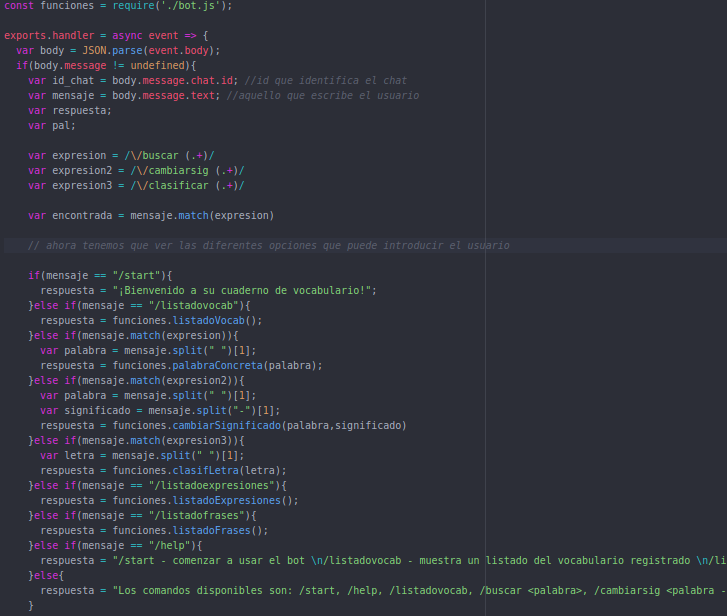

Vemos que la función comienza extrayendo los datos del cuerpo de la petición, y a partir de ahí obtendremos el *id del chat*, y el *mensaje*.
Podemos apreciar que se han definido varias expresiones regulares, esto se ha utilizado para poder usar comandos del estilo **/buscar <palabra>** de manera que nuestra expresión regular **/ \ /buscar (.+)/** nos indica que vamos a poner */buscar* seguido de algo más, en este caso de una palabra.
Si queremos extraer la palabra para usarla de parámetro, usamos el método **split()** indicando que a partir del primer espacio nos vamos a quedar con el string que nos encontremos.

Lo siguiente que tenemos es una estructura de bucle *if-else* un poco extensa, cierto es que esta estructura podría cambiarse por un *switch* y sería un poco más eficiente nuestro código, pero ambas alternativas funcionan correctamente. En estas líneas simplemente valoramos los diferentes comandos y asignamos un valor a la respuesta que vamos a proporcionar a nuestro usuario.

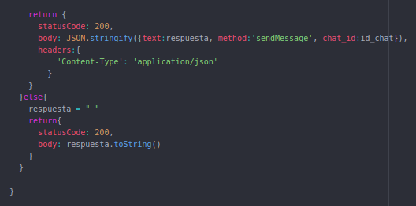

Finalmente, devolvemos nuestra respuesta, indicando que el método que vamos a usar es *sendMessage*, el texto de la respuesta será aquello que hay guardado en nuestra variable *respuesta* e irá dirigido al chat cuyo id sea el de la variable *id_chat*.

**Aclaración:** al principio, justo después de extraer los datos del cuerpo de la petición, vemos que hay una sentencia *if*, esto se debe a que en algunas ocasiones surge este error:

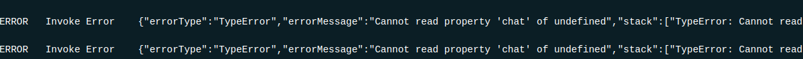

Entonces para poder arreglarlo tenemos que valorar dicho caso, y simplemente mandamos una respuesta vacía, tras esto, nuestro bot funciona a la perfección.

#### USO DEL WEBHOOK
Para establecer nuestro Webhook hacemos uso del siguiente enlace:
~~~
https://api.telegram.org/bot{bot_token}/setWebhook?url={ruta donde tenemos desplegado el bot}
~~~

En mi caso, la ruta es la siguiente: https://proyecto-idiomas.netlify.app/.netlify/functions/index
Y si todo ha funcionado correctamente nos debe salir por pantalla lo siguiente:

#### COMPROBACIÓN DEL CORRECTO FUNCIONAMIENTO
Vamos a acceder a nuestro Bot mediante el siguiente [enlace](https://t.me/YourVocab_bot) o buscando en Telegram **@YourVocab_bot** y veremos como funciona correctamente.
Si entramos por primera vez al Bot, lo más recomendable es hacer uso del comando **/help** para ver cuales son los comandos que hay disponibles.

Y simplemente nos queda ir probando los diversos comandos:

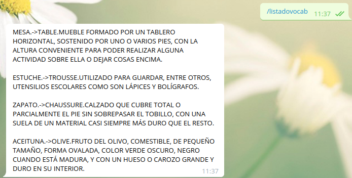

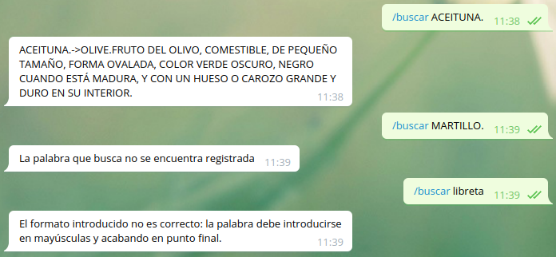

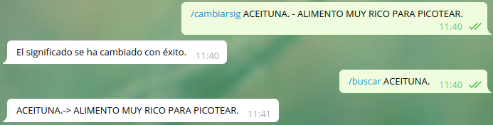

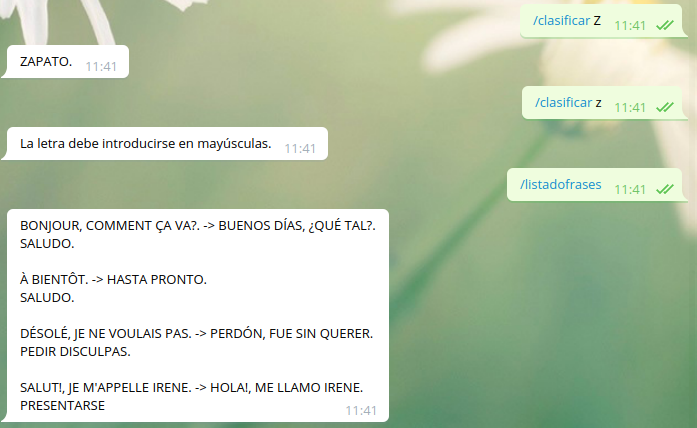

